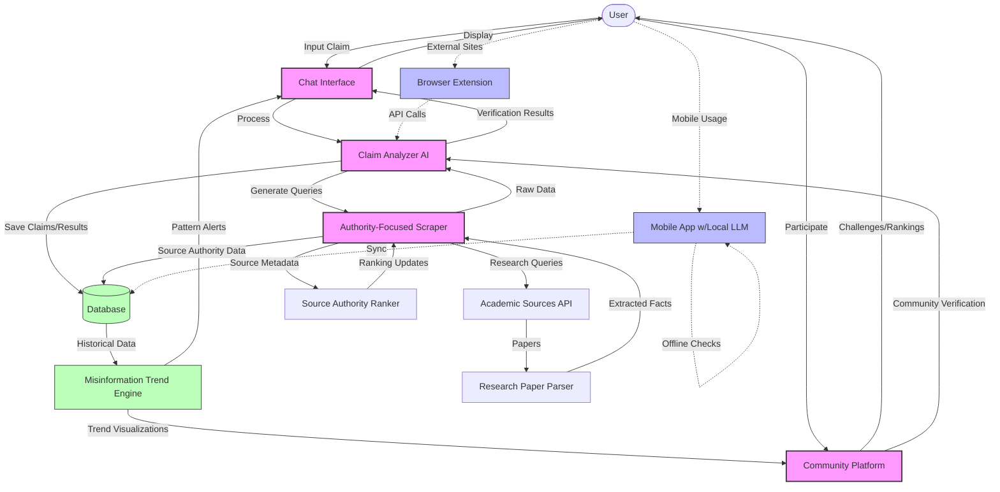
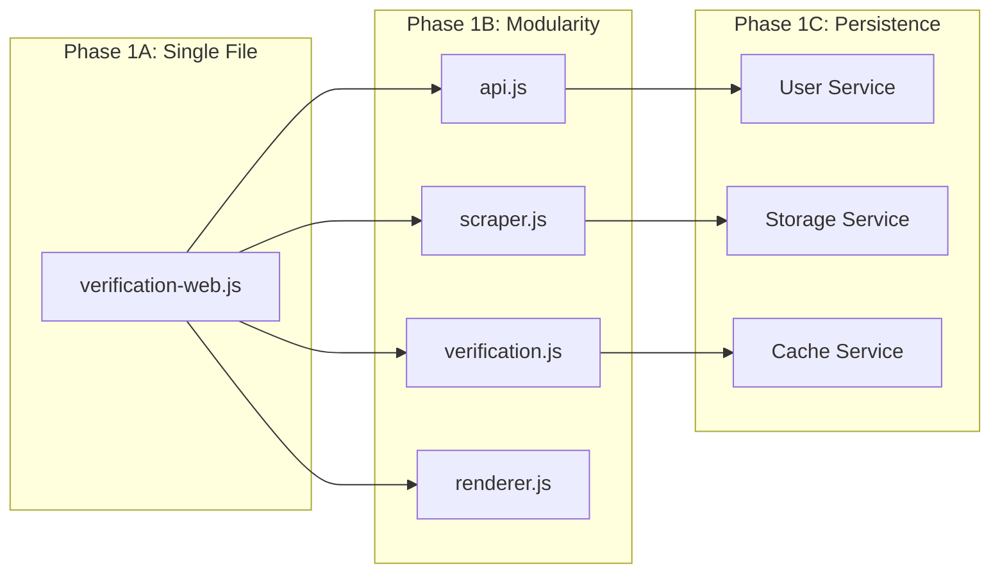

# Truth Engine: Implementation Plan

## Executive Summary

This document details the plan for creating "Truth Engine" - a revolutionary fact-checking platform focused on delivering "the truth, the whole truth, and nothing but the truth." The system will transform the existing verification.mjs script into a robust web application with an integrated, high-performance web scraper that prioritizes authoritative sources. The platform will feature advanced security measures, misinformation trend tracking, and community engagement features, all designed for implementation by a small development team.

Our immediate priorities are security implementation and transforming verification.mjs into a web-based solution while replacing the Firecrawl dependency with a custom scraper.

## Table of Contents

1. [Project Vision & Core Concepts](#project-vision--core-concepts)
2. [Security Foundation & Data Protection](#security-foundation--data-protection)
3. [Verification.mjs Transformation](#verificationmjs-transformation)
4. [Custom Web Scraper Implementation](#custom-web-scraper-implementation)
5. [Technical Architecture](#technical-architecture)
6. [Implementation Timeline](#implementation-timeline)
7. [Advanced Features for Future Development](#advanced-features-for-future-development)

## Project Vision & Core Concepts

The Truth Engine will provide a specialized fact-checking service that differentiates itself from general AI tools like ChatGPT through:

- **Source Transparency**: Direct linking to authoritative sources
- **Specialized Purpose**: Laser focus on fact verification rather than general conversation
- **Community Trust**: Human verification alongside AI verification
- **Real-Time Web Data**: Custom scraper pulling current information rather than relying on training data cutoff

### Core Components

1. **Chat Input Interface**: Simple, intuitive interface for submitting claims
2. **AI-Powered Verification**: Leveraging models to analyze claims and evidence
3. **Authoritative Web Scraper**: Specialized in finding and extracting information from credible sources
4. **Misinformation Trend Analysis**: Tracking and visualizing patterns in false claims
5. **Security Framework**: Comprehensive protection for users and platform integrity

## Security Foundation & Data Protection

Security and privacy protection are fundamental to the Truth Engine platform from inception, not added as an afterthought.

### Comprehensive Security Framework

#### Data Protection
- **End-to-End Encryption**: All user claims and verification data encrypted in transit and at rest
- **Zero-Knowledge Architecture**: Minimized data retention with options for ephemeral sessions
- **Encrypted Storage**: AES-256 encryption for all sensitive data
- **Secure Key Management**: Hardware security modules (where available) or secure key vaults

#### Access Control
- **Strict Authentication**: OAuth 2.0 implementation with support for third-party authentication
- **Multi-Factor Authentication**: Optional MFA for all user accounts
- **Role-Based Access Control**: Granular permissions system for different user types
- **Session Management**: Secure session handling with automatic timeouts and device tracking

#### Privacy Preservation
- **Data Minimization**: Collect only essential information for functionality
- **Privacy-Preserving Analytics**: Aggregated, anonymized trend data that can't be traced to individuals
- **Configurable Privacy Settings**: User controls for data retention and sharing
- **GDPR/CCPA Compliance**: Built-in tools for data access, portability, and deletion requests

### Misuse Prevention

- **Rate Limiting**: Tiered API access controls to prevent scraper abuse or DoS attacks
   - IP-based limiting for anonymous users
   - Token bucket algorithm implementation for authenticated users
   - Automatic throttling when system load is high
   
- **Content Safety Filters**:
   - Pre-processing filters to detect and block attempts to verify harmful content
   - Content classification system to flag potentially problematic submissions
   - Pattern matching against known abuse vectors
   
- **IP Reputation Scoring**:
   - Integration with IP reputation databases
   - Internal reputation tracking based on usage patterns
   - Block known VPN/proxy abuse patterns when detected
   
- **Anomaly Detection**:
   - Machine learning models to identify unusual usage patterns
   - CAPTCHA Integration with selective challenge prompts when suspicious patterns detected
   - Automated temporary restrictions for accounts showing anomalous behavior

### Transparency Controls

- **User Data Dashboard**: Clear visualization of what data is stored and for how long
- **Deletion Workflows**: One-click permanent removal of user history
- **Audit Logging**: Immutable record of all system actions for security review
- **Transparency Reports**: Regular publishing of platform usage statistics and security incidents

### Security-First Development Practices

- **OWASP Testing**: Systematic testing against OWASP Top 10 vulnerabilities
- **Dependency Scanning**: Automated checks for security issues in third-party packages
- **Static Analysis**: Automated code scanning for security vulnerabilities
- **Code Review Focus**: Security-focused peer review for all new code
- **Penetration Testing**: Regular attempts to find and fix security flaws
- **Infrastructure as Code**: Secure configuration templates for all infrastructure

### Data Lifecycle Management

- **Classification System**: Label data by sensitivity level
  - Level 1: Public information (verification results)
  - Level 2: Aggregated analytics (trends, patterns)
  - Level 3: User-specific information (search history)
  - Level 4: Personal identifiable information (account details)

- **Minimization Policy**: Only collect what's absolutely necessary
- **Retention Limits**: Automatically expire data based on type
  - Level 1: Indefinite (public knowledge)
  - Level 2: 2 years (for trend analysis)
  - Level 3: 90 days by default (configurable by user)
  - Level 4: Until account deletion

- **Access Controls**: Fine-grained permissions for different data categories

## Verification.mjs Transformation

### Initial Conversion Strategy

The transformation of verification.mjs into a web application will follow these steps:

1. **Analysis of Current Functionality**:
   - Identify core verification logic components
   - Map terminal outputs to web-friendly formats
   - Locate Firecrawl dependencies for replacement

2. **Create Web Server Wrapper**:
   - Implement Express.js application structure
   - Define API endpoints for verification requests
   - Establish error handling middleware

3. **Develop Simple Frontend**:
   - Create minimal HTML/CSS/JS interface
   - Implement claim submission form
   - Design results display component

4. **Integrate Verification Logic**:
   - Adapt verification.mjs functions for HTTP context
   - Transform console logging to structured responses
   - Implement proper async/await patterns for web context

5. **Add Robustness Improvements**:
   - **Exponential Backoff**: Auto-retry with increasing delays for transient failures
   - **Circuit Breaker Pattern**: Prevent cascading failures when dependent services are down
   - **Graceful Degradation**: Fall back to simpler verification when full process can't complete
   - **Comprehensive Logging**: Detailed logs of each verification step for debugging
   - **Health Checks**: Self-monitoring to detect and report component issues

### Single-File Implementation Example

```javascript
// verification-web.js - Initial transformation of verification.mjs to web application

// Import required packages
import express from 'express';
import cors from 'cors';
import helmet from 'helmet'; // Security middleware
import rateLimit from 'express-rate-limit'; // Rate limiting
import { fileURLToPath } from 'url';
import path from 'path';
import fs from 'fs';
import http from 'http';
import https from 'https';

// ES Module equivalent for __dirname
const __filename = fileURLToPath(import.meta.url);
const __dirname = path.dirname(__filename);

// Initialize Express
const app = express();
const PORT = process.env.PORT || 3000;

// Security middleware
app.use(helmet()); // Sets various HTTP headers for security
app.use(cors({
  origin: process.env.NODE_ENV === 'production' 
    ? ['https://yourdomain.com'] 
    : '*'
}));

// Rate limiting
const limiter = rateLimit({
  windowMs: 15 * 60 * 1000, // 15 minutes
  max: 100, // limit each IP to 100 requests per windowMs
  standardHeaders: true,
  legacyHeaders: false,
  message: 'Too many requests from this IP, please try again later'
});
app.use('/api/', limiter);

// Body parsing
app.use(express.json({ limit: '1mb' }));
app.use(express.urlencoded({ extended: true, limit: '1mb' }));

// Serve static files
app.use(express.static(path.join(__dirname, 'public')));

// Logging setup
const log = {
  info: (...args) => {
    console.log('\x1b[36m[INFO]\x1b[0m', ...args);
    return args.join(' ');
  },
  warn: (...args) => {
    console.log('\x1b[33m[WARN]\x1b[0m', ...args);
    return args.join(' ');
  },
  error: (...args) => {
    console.log('\x1b[31m[ERROR]\x1b[0m', ...args);
    return args.join(' ');
  },
  success: (...args) => {
    console.log('\x1b[32m[SUCCESS]\x1b[0m', ...args);
    return args.join(' ');
  },
  result: (...args) => {
    console.log('\x1b[35m[RESULT]\x1b[0m', ...args);
    return args.join(' ');
  }
};

// Custom web scraper (replacing Firecrawl)
async function customWebScraper(query) {
  // Robust error handling
  try {
    // Authorization header management
    const headers = {
      'User-Agent': 'Mozilla/5.0 (Windows NT 10.0; Win64; x64) AppleWebKit/537.36 (KHTML, like Gecko) Chrome/91.0.4472.124 Safari/537.36',
      'Accept': 'text/html,application/xhtml+xml,application/xml;q=0.9,image/webp,*/*;q=0.8',
      'Accept-Language': 'en-US,en;q=0.5',
      'Connection': 'keep-alive',
      'Upgrade-Insecure-Requests': '1',
      'Cache-Control': 'max-age=0',
    };
    
    // For demonstration - in actual implementation, this would use proper scraping tools
    const searchUrl = `https://www.google.com/search?q=${encodeURIComponent(query)}`;
    
    const searchResults = await new Promise((resolve, reject) => {
      https.get(searchUrl, { headers }, (res) => {
        let data = '';
        res.on('data', (chunk) => { data += chunk; });
        res.on('end', () => {
          // Very basic extraction - would be much more sophisticated in practice
          const links = [];
          const linkRegex = /<a href="(https?:\/\/(?!google\.com)[^"]+)"/g;
          let match;
          while ((match = linkRegex.exec(data)) !== null) {
            if (!links.includes(match[1])) links.push(match[1]);
          }
          
          resolve(links.slice(0, 10).map(url => ({ url })));
        });
        res.on('error', reject);
      }).on('error', reject);
    });
    
    // In a real implementation, we would fetch and parse content from these URLs
    const mockResults = searchResults.map(item => ({
      url: item.url,
      title: `Page about ${query}`,
      markdown: `This is mock content about ${query} for demonstration purposes.`
    }));
    
    return {
      data: mockResults,
      status: "success"
    };
  } catch (error) {
    log.error("Scraper failure", error);
    // Fallback to empty results
    return {
      data: [],
      status: "error",
      message: error.message
    };
  }
}

// Simple HTTP/HTTPS request function (Used by Ollama Direct Mode) - From original verification.mjs
function request(url, options = {}, data = null) {
  return new Promise((resolve, reject) => {
    const isHttps = url.startsWith('https');
    const lib = isHttps ? https : http;
    
    const req = lib.request(url, options, (res) => {
      let body = '';
      res.on('data', (chunk) => body += chunk);
      res.on('end', () => {
        if (res.statusCode >= 200 && res.statusCode < 300) {
          try {
            const json = JSON.parse(body);
            resolve({ ok: true, status: res.statusCode, data: json });
          } catch (e) {
            resolve({ ok: true, status: res.statusCode, data: body });
          }
        } else {
          resolve({ ok: false, status: res.statusCode, data: body });
        }
      });
    });
    
    req.on('error', reject);
    if (data) req.write(typeof data === 'string' ? data : JSON.stringify(data));
    req.end();
  });
}

// The rest of verification.mjs functions, adapted for web context
// ...analyzeWithOllama, analyzeSearchResultsWithOllama, etc.

// For brevity, we're not including all functions, just the key changes for web adaptation
async function analyzeWithOllama(content, currentDateTime) {
   log.info("(Web) Analyzing claims using Ollama...");
   const ollamaUrl = process.env.OLLAMA_URL || "http://localhost:11434";
   // Rest similar to verification.mjs but with web-specific logging
   // ...
}

// Main verification function, adapted for web
async function verifyContent(content) {
  const currentDateTime = new Date().toISOString(); 
  log.info(`(Web) Verification started at: ${currentDateTime}`);
  log.info("\n=== (Web) INITIAL CONTENT ===");
  log.info(content);
  
  // Create a results object to track progress and return to client
  const results = {
    originalContent: content,
    verifiedContent: content,
    status: "processing",
    progress: 0,
    claims: [],
    changes: 0,
    results: [],
    logs: []
  };
  
  // Log capture for client
  const captureLog = (type, message) => {
    results.logs.push({ type, message, timestamp: new Date().toISOString() });
    return log[type](message);
  };
  
  try {
    captureLog("info", "\n=== (Web) ANALYZING CLAIMS (Ollama) ===");
    results.progress = 10;
    
    const claims = await analyzeWithOllama(content, currentDateTime); 
    captureLog("info", `(Web) Extracted ${claims.length} claims to verify`);
    results.claims = claims;
    results.progress = 30;
    
    claims.forEach((claim, i) => {
      captureLog("info", `(Web) Claim ${i+1}: "${claim.claimText || 'N/A'}"`);
      captureLog("info", `  Search Queries: ${claim.searchQueries?.join(' | ') || 'N/A'}`);
    });
    
    captureLog("info", "\n=== (Web) VERIFYING CLAIMS ===");
    let verifiedContent = content;
    const verificationResults = [];
    results.progress = 50;
    
    for (const claim of claims) {
      if (!claim.searchQueries || claim.searchQueries.length === 0) {
        captureLog("warn", `(Web) Skipping claim without search queries: "${claim.claimText}"`);
        continue;
      }
      
      const primarySearchQuery = claim.searchQueries[0];
      captureLog("info", `(Web) Searching for claim "${claim.claimText}" using query: "${primarySearchQuery}"`);
      
      // Use custom web scraper instead of Firecrawl
      const searchResponse = await customWebScraper(primarySearchQuery);
      
      if (!searchResponse || !searchResponse.data || searchResponse.data.length === 0) {
        captureLog("warn", `(Web) No search results for claim: "${claim.claimText}" (Query: ${primarySearchQuery})`);
        continue;
      }
      
      const combinedResultsText = searchResponse.data
        .map(item => `Source: ${item.url || 'N/A'}\nTitle: ${item.title || ""}\nContent:\n${item.markdown || ""}`)
        .join("\n\n---\n\n");
  
      captureLog("info", `(Web) Analyzing ${searchResponse.data.length} search results with Ollama...`);
      // ... Continue with similar logic to verification.mjs
    }
    
    results.status = "completed";
    results.progress = 100;
    results.verifiedContent = verifiedContent;
    results.changes = verificationResults.length;
    results.results = verificationResults;
    
    return results;
    
  } catch (error) {
    captureLog("error", `Verification error: ${error.message}`);
    results.status = "error";
    results.error = error.message;
    return results;
  }
}

// Define API routes
app.post('/api/verify', async (req, res) => {
  try {
    const { content } = req.body;
    
    if (!content) {
      return res.status(400).json({ 
        error: 'Content is required'
      });
    }
    
    // Start verification process
    const results = await verifyContent(content);
    
    // Return results
    return res.json(results);
  } catch (error) {
    console.error('API Error:', error);
    return res.status(500).json({ 
      error: 'Internal server error',
      message: error.message
    });
  }
});

// Health check endpoint
app.get('/health', (req, res) => {
  res.json({ status: 'ok', timestamp: new Date().toISOString() });
});

// Serve the main HTML page
app.get('/', (req, res) => {
  res.sendFile(path.join(__dirname, 'public', 'index.html'));
});

// Start the server
app.listen(PORT, () => {
  console.log(`Truth Engine server running on port ${PORT}`);
});

export default app;
```

### Frontend Implementation (public/index.html)

```html
<!DOCTYPE html>
<html lang="en">
<head>
  <meta charset="UTF-8">
  <meta name="viewport" content="width=device-width, initial-scale=1.0">
  <title>Truth Engine</title>
  <link rel="stylesheet" href="styles.css">
</head>
<body>
  <header>
    <h1>Truth Engine</h1>
    <p>Dedicated to the truth, the whole truth, and nothing but the truth.</p>
  </header>
  
  <main>
    <section id="verification-form">
      <h2>Submit content to verify</h2>
      <form id="claim-form">
        <textarea id="content-input" placeholder="Paste a statement, social media post, or any content to fact-check..."></textarea>
        <button type="submit" id="verify-button">Verify Facts</button>
      </form>
    </section>
    
    <section id="results-container" class="hidden">
      <div id="loading-indicator" class="hidden">
        <div class="spinner"></div>
        <p>Analyzing content and checking facts...</p>
        <div id="progress-bar">
          <div id="progress-fill"></div>
        </div>
        <div id="status-message"></div>
      </div>
      
      <div id="results-display" class="hidden">
        <h2>Verification Results</h2>
        
        <div id="claims-section">
          <h3>Claims Identified</h3>
          <ul id="claims-list"></ul>
        </div>
        
        <div id="verification-section">
          <h3>Verification Details</h3>
          <div id="verification-results"></div>
        </div>
        
        <div id="final-content">
          <h3>Verified Content</h3>
          <div id="verified-text"></div>
        </div>
      </div>
    </section>
  </main>
  
  <footer>
    <p>&copy; 2025 Truth Engine - A fact-checking platform</p>
  </footer>

  <script src="app.js"></script>
</body>
</html>
```

### Frontend JavaScript (public/app.js)

```javascript
document.addEventListener('DOMContentLoaded', () => {
  const claimForm = document.getElementById('claim-form');
  const contentInput = document.getElementById('content-input');
  const verifyButton = document.getElementById('verify-button');
  const resultsContainer = document.getElementById('results-container');
  const loadingIndicator = document.getElementById('loading-indicator');
  const resultsDisplay = document.getElementById('results-display');
  const progressFill = document.getElementById('progress-fill');
  const statusMessage = document.getElementById('status-message');
  const claimsList = document.getElementById('claims-list');
  const verificationResults = document.getElementById('verification-results');
  const verifiedText = document.getElementById('verified-text');

  // Form submission handler
  claimForm.addEventListener('submit', async (e) => {
    e.preventDefault();
    
    const content = contentInput.value.trim();
    if (!content) {
      alert('Please enter content to verify.');
      return;
    }
    
    // Show loading state
    verifyButton.disabled = true;
    resultsContainer.classList.remove('hidden');
    loadingIndicator.classList.remove('hidden');
    resultsDisplay.classList.add('hidden');
    progressFill.style.width = '5%';
    statusMessage.textContent = 'Initializing verification...';
    
    try {
      // Call the API
      const response = await fetch('/api/verify', {
        method: 'POST',
        headers: {
          'Content-Type': 'application/json'
        },
        body: JSON.stringify({ content })
      });
      
      if (!response.ok) {
        throw new Error('Verification failed. Please try again.');
      }
      
      const result = await response.json();
      
      // Update progress (in a real app, this would use WebSockets or SSE for live updates)
      progressFill.style.width = '100%';
      statusMessage.textContent = 'Verification complete!';
      
      // Display results
      displayResults(result);
      
    } catch (error) {
      statusMessage.textContent = `Error: ${error.message}`;
      progressFill.style.width = '100%';
      progressFill.style.backgroundColor = 'red';
    } finally {
      // Hide loading, show results
      loadingIndicator.classList.add('hidden');
      resultsDisplay.classList.remove('hidden');
      verifyButton.disabled = false;
    }
  });
  
  function displayResults(result) {
    // Clear previous results
    claimsList.innerHTML = '';
    verificationResults.innerHTML = '';
    
    // Display claims
    if (result.claims && result.claims.length > 0) {
      result.claims.forEach((claim, index) => {
        const li = document.createElement('li');
        li.textContent = `Claim ${index + 1}: ${claim.claimText}`;
        claimsList.appendChild(li);
      });
    } else {
      claimsList.innerHTML = '<li>No specific claims identified.</li>';
    }
    
    // Display verification results
    if (result.results && result.results.length > 0) {
      const resultsList = document.createElement('ul');
      result.results.forEach(item => {
        const li = document.createElement('li');
        li.innerHTML = `
          <strong>Claim:</strong> ${item.claim}<br>
          <strong>Status:</strong> <span class="status-${item.status.toLowerCase()}">${item.status}</span><br>
          <strong>Original:</strong> ${item.originalValue}<br>
          <strong>Verified Value:</strong> ${item.verifiedValue}<br>
          <strong>Source:</strong> ${item.source}
        `;
        resultsList.appendChild(li);
      });
      verificationResults.appendChild(resultsList);
    } else {
      verificationResults.textContent = 'No claims were successfully verified.';
    }
    
    // Display verified text
    verifiedText.textContent = result.verifiedContent;
    
    // Add comparison highlight (in a real app, this would use a diff library)
    if (result.originalContent !== result.verifiedContent) {
      const diffNotice = document.createElement('div');
      diffNotice.className = 'diff-notice';
      diffNotice.textContent = 'Content was modified based on fact verification.';
      verifiedText.parentNode.insertBefore(diffNotice, verifiedText);
    }
  }
});
```

### Frontend CSS (public/styles.css)

```css
/* Basic styling for the Truth Engine web interface */
* {
  box-sizing: border-box;
  margin: 0;
  padding: 0;
}

body {
  font-family: -apple-system, BlinkMacSystemFont, 'Segoe UI', Roboto, Oxygen, Ubuntu, Cantarell, 'Open Sans', 'Helvetica Neue', sans-serif;
  line-height: 1.6;
  color: #333;
  background-color: #f9f9f9;
  padding: 20px;
  max-width: 1200px;
  margin: 0 auto;
}

header {
  text-align: center;
  margin-bottom: 40px;
  padding-bottom: 20px;
  border-bottom: 1px solid #eee;
}

h1 {
  color: #1a73e8;
  margin-bottom: 10px;
}

main {
  background-color: white;
  border-radius: 8px;
  box-shadow: 0 2px 10px rgba(0, 0, 0, 0.1);
  padding: 30px;
}

#verification-form {
  margin-bottom: 30px;
}

textarea {
  width: 100%;
  min-height: 150px;
  padding: 15px;
  border: 1px solid #ddd;
  border-radius: 4px;
  font-size: 16px;
  margin-bottom: 15px;
  resize: vertical;
}

button {
  background-color: #1a73e8;
  color: white;
  border: none;
  padding: 12px 24px;
  border-radius: 4px;
  font-size: 16px;
  cursor: pointer;
  transition: background-color 0.3s;
}

button:hover {
  background-color: #1557b0;
}

button:disabled {
  background-color: #a1c0ea;
  cursor: not-allowed;
}

.hidden {
  display: none;
}

#loading-indicator {
  text-align: center;
  padding: 20px;
}

.spinner {
  border: 4px solid rgba(0, 0, 0, 0.1);
  width: 36px;
  height: 36px;
  border-radius: 50%;
  border-left-color: #1a73e8;
  animation: spin 1s ease infinite;
  margin: 0 auto 15px;
}

@keyframes spin {
  0% { transform: rotate(0deg); }
  100% { transform: rotate(360deg); }
}

#progress-bar {
  height: 10px;
  background-color: #eee;
  border-radius: 5px;
  margin: 15px 0;
  overflow: hidden;
}

#progress-fill {
  height: 100%;
  background-color: #1a73e8;
  width: 0;
  transition: width 0.3s ease;
}

#results-display h2 {
  margin-bottom: 20px;
  padding-bottom: 10px;
  border-bottom: 1px solid #eee;
}

#claims-section, 
#verification-section, 
#final-content {
  margin-bottom: 30px;
}

h3 {
  margin-bottom: 15px;
  color: #444;
}

ul {
  list-style-type: none;
  padding-left: 0;
}

li {
  padding: 10px 15px;
  border-left: 3px solid #1a73e8;
  background-color: #f8f9fa;
  margin-bottom: 10px;
}

#verification-results li {
  padding: 15px;
  border-radius: 4px;
  box-shadow: 0 1px 3px rgba(0, 0, 0, 0.1);
}

.status-confirms {
  color: green;
  font-weight: bold;
}

.status-refutes {
  color: red;
  font-weight: bold;
}

.status-uncertain {
  color: orange;
  font-weight: bold;
}

#verified-text {
  padding: 15px;
  border: 1px solid #ddd;
  border-radius: 4px;
  background-color: #f8f9fa;
  white-space: pre-wrap;
}

.diff-notice {
  padding: 8px 15px;
  background-color: #e8f0fe;
  color: #1a73e8;
  border-radius: 4px;
  margin-bottom: 10px;
  font-size: 14px;
}

footer {
  text-align: center;
  margin-top: 40px;
  color: #666;
  font-size: 14px;
}

@media (max-width: 768px) {
  body {
    padding: 10px;
  }
  
  main {
    padding: 15px;
  }
  
  button {
    width: 100%;
  }
}
```

## Custom Web Scraper Implementation

### Core Components

The custom web scraper will replace the Firecrawl API dependency with a robust, high-performance solution that prioritizes authoritative sources.

#### Multi-Source Aggregator

```javascript
// Example of the source aggregator component
async function aggregateFromMultipleSources(query) {
  // Track performance
  const startTime = performance.now();
  
  try {
    // Run searches in parallel across multiple sources
    const results = await Promise.allSettled([
      searchGoogle(query),
      searchBing(query),
      searchScholar(query),
      searchGovernmentSites(query),
      searchNewsAPI(query)
    ]);
    
    // Extract successful results
    const validResults = results
      .filter(result => result.status === 'fulfilled')
      .map(result => result.value);
    
    // Log performance
    const duration = performance.now() - startTime;
    log.info(`Multi-source search completed in ${duration.toFixed(2)}ms with ${validResults.length} sources`);
    
    // Combine and return
    return combineResults(validResults);
  } catch (error) {
    log.error(`Multi-source aggregation error: ${error.message}`);
    // Attempt fallback to most reliable source only
    return searchGoogle(query);
  }
}
```

#### Authority Ranking Algorithm

```javascript
// Example snippet of the authority ranking system
function rankSourcesByAuthority(sources) {
  return sources.map(source => {
    // Extract domain
    const domain = extractDomain(source.url);
    
    // Base authority score
    let score = 50;
    
    // Domain type bonus
    if (domain.endsWith('.gov')) score += 30;
    if (domain.endsWith('.edu')) score += 25;
    if (domain.endsWith('.org')) score += 15;
    
    // Known reliable sources
    const reliableSources = [
      'reuters.com', 'apnews.com', 'bbc.com', 'nature.com', 
      'science.org', 'nih.gov', 'who.int', 'census.gov',
      'britannica.com', 'nytimes.com', 'washingtonpost.com'
    ];
    
    if (reliableSources.some(s => domain.includes(s))) {
      score += 20;
    }
    
    // Penalize known questionable sources
    const questionableSources = [/* list of known unreliable domains */];
    if (questionableSources.some(s => domain.includes(s))) {
      score -= 40;
    }
    
    // Algorithm would be much more sophisticated in production
    // Including checking SSL, site age, external ratings, etc.
    
    return {
      ...source,
      authorityScore: Math.max(0, Math.min(100, score))
    };
  })
  .sort((a, b) => b.authorityScore - a.authorityScore);
}
```

#### Content Extraction Engine

```javascript
// Example of the content extraction component
async function extractContentFromUrl(url) {
  try {
    // Fetch the content
    const response = await fetch(url, {
      headers: {
        'User-Agent': 'Mozilla/5.0 (Windows NT 10.0; Win64; x64) AppleWebKit/537.36 (KHTML, like Gecko) Chrome/91.0.4472.124 Safari/537.36'
      }
    });
    
    const html = await response.text();
    
    // Use readability algorithm to extract main content
    const { document } = (new JSDOM(html)).window;
    const reader = new Readability(document);
    const article = reader.parse();
    
    if (!article || !article.content) {
      throw new Error('Failed to extract readable content');
    }
    
    // Extract key data
    return {
      title: article.title,
      content: article.textContent,
      html: article.content,
      excerpt: article.excerpt,
      siteName: article.siteName,
      publishDate: extractPublishDate(html),
      author: extractAuthor(html)
    };
  } catch (error) {
    log.error(`Content extraction error for ${url}: ${error.message}`);
    return null;
  }
}
```

#### Anti-Detection & Proxy Management

```javascript
// User agent rotation
const USER_AGENTS = [
  'Mozilla/5.0 (Windows NT 10.0; Win64; x64) AppleWebKit/537.36 (KHTML, like Gecko) Chrome/91.0.4472.124 Safari/537.36',
  'Mozilla/5.0 (Macintosh; Intel Mac OS X 10_15_7) AppleWebKit/605.1.15 (KHTML, like Gecko) Version/14.1.1 Safari/605.1.15',
  'Mozilla/5.0 (Windows NT 10.0; Win64; x64; rv:89.0) Gecko/20100101 Firefox/89.0',
  // Add more user agents
];

// Proxy rotation (simplified)
const PROXY_POOL = [
  { host: 'proxy1.example.com', port: 8080, auth: { username: 'user1', password: 'pass1' } },
  { host: 'proxy2.example.com', port: 8080, auth: { username: 'user2', password: 'pass2' } },
  // Add more proxies
];

function getRandomUserAgent() {
  return USER_AGENTS[Math.floor(Math.random() * USER_AGENTS.length)];
}

function getRandomProxy() {
  return PROXY_POOL[Math.floor(Math.random() * PROXY_POOL.length)];
}

// Apply to fetch operations
async function fetchWithRotation(url) {
  const userAgent = getRandomUserAgent();
  const proxy = process.env.USE_PROXIES === 'true' ? getRandomProxy() : null;
  
  // Apply random delay to mimic human behavior
  await new Promise(r => setTimeout(r, 1000 + Math.random() * 2000));
  
  let options = {
    headers: {
      'User-Agent': userAgent,
      // Other headers
    }
  };
  
  if (proxy) {
    // Apply proxy configuration (implementation depends on HTTP client)
  }
  
  return fetch(url, options);
}
```

## Technical Architecture

### System Components



### Phased Architecture Evolution



### Technology Stack

#### Initial Stack (Simplicity-Focused)
- **Backend**: Express.js (leveraging existing Node.js in verification.mjs)
- **Frontend**: Vanilla JS with minimal dependencies
- **Scraping**: Combination of axios/cheerio for lightweight scraping, puppeteer for complex sites
- **Database**: SQLite for initial storage (easy deployment, zero configuration)
- **Hosting**: Simple deployment to Vercel/Netlify for frontend, Node.js service for backend

#### Later Evolution
- **Backend**: Migration to FastAPI or NestJS for improved performance and structure
- **Frontend**: React with TypeScript for scalable UI development
- **Database**: PostgreSQL for robust data storage
- **Containerization**: Docker for consistent deployment
- **Performance**: Strategic Rust components for high-performance scraping

## Implementation Timeline

| Timeframe | Focus | Key Deliverables |
|-----------|-------|------------------|
| Weeks 1-2 | verification.mjs → Web | - Basic website with working verification<br>- Simple chat interface<br>- Core verification logic adapted to web context |
| Weeks 3-4 | Custom Scraper | - Firecrawl replacement with source ranking<br>- Multi-source aggregation<br>- Authority ranking algorithm |
| Weeks 5-6 | Robustness & Security | - End-to-end encryption<br>- Error handling<br>- Rate limiting<br>- Input validation |
| Weeks 7-8 | UX Improvements | - Improved results display<br>- Basic caching<br>- Visual design refinements |
| Weeks 9-12 | Modularization | - Refactor to component architecture<br>- API improvements<br>- Performance optimizations |
| Months 4-6 | Core Platform | - Complete verification platform<br>- Basic trend analysis<br>- Community features foundations |
| Months 7-9 | Extensions | - Browser extension development<br>- Mobile app prototype<br>- Local LLM integration research |
| Months 10-12 | Full Ecosystem | - Advanced misinformation trends<br>- Complete mobile app<br>- Challenge system |

## Advanced Features for Future Development

### Misinformation Trend Analysis System

A key differentiator will be the platform's ability to track and visualize misinformation patterns over time:

- **Temporal Trend Visualization**: Track the spread of specific false claims over time
- **Geographic Heat Mapping**: Show regional concentrations of misinformation
- **Source Correlation Analysis**: Identify which sources frequently originate or amplify false claims
- **Early Warning System**: Flag sudden increases in related misleading claims
- **Predictive Analytics**: Use historical patterns to predict which topics may see misinformation spikes

### Browser Extension

To reach users where they consume content:

- **Inline Fact-Checking**: Highlight questionable claims on social media and news sites
- **Right-Click Verification**: Select text on any page to fact-check instantly
- **Source Credibility Overlay**: Visual indicators of website reliability directly on visited pages

### Mobile Application

For on-the-go fact checking:

- **Local LLM Integration**: Lightweight model for offline initial analysis
- **Camera Fact-Checking**: Scan printed material or screens to verify claims
- **Voice Input**: Speak claims to check verbal statements quickly

### Enhanced Community & Gamification

To drive engagement and build a "truth community":

- **Truth Trivia Challenges**: Gamified challenges to verify trending topics
- **Team Competitions**: Group challenges where teams compete to debunk or verify claims
- **Domain Specialization**: Users can earn credentials in specific topic areas
- **Truth Impact Score**: Measure each user's contribution to factual information online

---

This implementation plan provides a comprehensive roadmap for building the Truth Engine platform, starting with transforming verification.mjs into a robust web application with integrated custom web scraper, while maintaining a strong focus on security from the ground up. The phased approach ensures manageable development for a small team while steadily progressing toward the full vision.